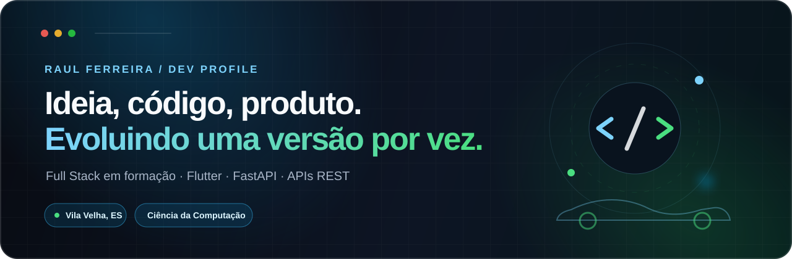
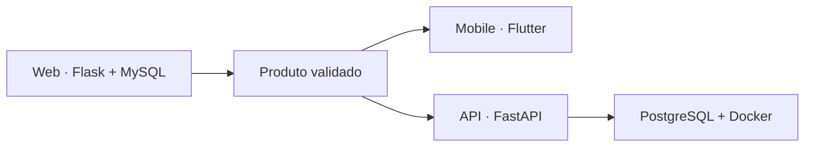
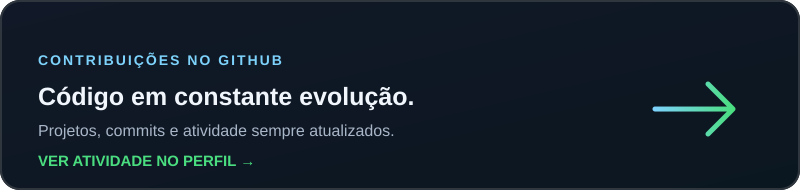

<p align="center">
  
</p>

<p align="center">
  <a href="https://raullferreiraa.github.io/">
    
  </a>
  <a href="https://www.linkedin.com/in/raullferreiraa">
    
  </a>
  <a href="mailto:raulsfr59@gmail.com">
    
  </a>
</p>

## `> whoami`

Sou estudante de **Ciência da Computação na UVV** e desenvolvedor Full Stack em formação. Gosto de pegar uma ideia ainda meio abstrata, transformá-la em um produto funcional e acompanhar sua evolução — da modelagem do banco à interface que chega ao usuário.

Hoje, meu principal laboratório é a **Garagem Digital**: uma plataforma social automotiva que nasceu na web e agora está evoluindo para uma arquitetura mobile com Flutter e FastAPI.

```text
📍 Vila Velha, ES
🎓 Ciência da Computação — Universidade Vila Velha
🎯 Em busca de estágio em desenvolvimento de software
🧭 Foco atual: mobile, APIs, arquitetura e experiência de produto
```

## `> status --now`

<table>
  <tr>
    <td width="33%" valign="top">
      <h3>📱 Construindo</h3>
      <p>Nova experiência mobile da Garagem Digital com Flutter.</p>
    </td>
    <td width="33%" valign="top">
      <h3>⚙️ Conectando</h3>
      <p>FastAPI, PostgreSQL, Docker, JWT e armazenamento seguro.</p>
    </td>
    <td width="33%" valign="top">
      <h3>🧠 Evoluindo</h3>
      <p>Arquitetura, UX, testes e decisões orientadas ao produto.</p>
    </td>
  </tr>
</table>

## `> open garagem-digital`

<p align="center">
  <a href="https://github.com/raullferreiraa/garagem-digital">
    
  </a>
</p>

A **Garagem Digital** é meu projeto autoral e o lugar onde concentro minha evolução como desenvolvedor. A ideia é criar uma comunidade em que cada carro tenha identidade, história, evolução e equipe — fora da lógica acelerada das redes sociais tradicionais.

### A base que construí na web

A primeira versão foi idealizada e desenvolvida de ponta a ponta como uma aplicação web Full Stack. Foi nela que estruturei a proposta do produto e implementei seu núcleo funcional:

- API REST com **Python, Flask e MySQL/MariaDB**;
- autenticação, hash de senha, permissões e controle de propriedade;
- CRUD completo de projetos automotivos e upload validado de imagens;
- feed, garagem pessoal, busca, filtros e visualização detalhada;
- perfis com avatar, bio, `@username`, seguidores e contadores sociais;
- curtidas, comentários, galeria e diário de evolução dos carros;
- criação de equipes, solicitações de entrada e gestão de membros;
- interface dark responsiva e feedback visual para as ações.

### A evolução para mobile

Com o produto web consolidado, iniciei uma reconstrução focada em dispositivos móveis:



Na nova fase, já trabalhei com autenticação JWT e refresh automático, armazenamento seguro de tokens, cadastro de carros, upload com recorte de imagem, abas de exploração e garagem, além da criação de equipes e aprovação ou recusa de pedidos.

<p>
  
  
  
  
  
  
  
</p>

## `> cat outros-trabalhos.md`

<table>
  <tr>
    <td width="58%" valign="top">
      <h3>🖥️ PostoGestão</h3>
      <p>Sistema client-server com API REST em <strong>Kotlin + Spring Boot</strong>, banco PostgreSQL e interface desktop em Lazarus. Inclui integração com ViaCEP via HTTP/JSON.</p>
      <p><sub>Projeto acadêmico · código não publicado</sub></p>
      <p><code>Kotlin</code> <code>Spring Boot</code> <code>PostgreSQL</code> <code>Object Pascal</code></p>
    </td>
    <td width="42%" valign="top">
      <h3>🌐 Meu portfólio</h3>
      <p>Minha apresentação profissional, projetos, trajetória e formas de contato em uma experiência responsiva e acessível.</p>
      <p><a href="https://raullferreiraa.github.io/">Visitar portfólio →</a></p>
    </td>
  </tr>
</table>

## `> stack --current`

| Área | Tecnologias |
|:--|:--|
| **Mobile & Frontend** | Flutter, Dart, HTML, CSS, JavaScript, React, Next.js |
| **Backend & APIs** | Python, FastAPI, Flask, Kotlin, Spring Boot, Java, Node.js |
| **Dados & Infra** | PostgreSQL, MySQL, MariaDB, SQL, Docker, Alembic |
| **Processo** | Git, GitHub, issues, branches, pull requests e testes locais |

<p align="center"><strong>Stack principal agora</strong></p>

<p align="center">
  
  
  
  
  
  
</p>

<p align="center"><strong>Base técnica e repertório</strong></p>

<p align="center">
  
  
  
  
  
  
</p>

## `> git log --how-i-work`

```text
ideia → issue → branch → implementação → teste → pull request → evolução
```

- Quebro funcionalidades grandes em entregas menores e verificáveis.
- Documento contexto e decisões para conseguir retomar o trabalho com clareza.
- Uso branches e pull requests mesmo em projetos pessoais para praticar um fluxo consistente.
- Trato bugs encontrados durante testes como parte natural da evolução do produto.

## `> github --summary`

<p align="center">
  
</p>

<p align="center">
  
  
</p>

<p align="center">
  <a href="https://github.com/raullferreiraa?tab=overview">
    
  </a>
</p>

## `> cat fora-do-codigo.txt`

```text
🚗 Cultura automotiva e projetos com identidade
🎧 Música em diferentes estilos, letras e atmosferas
🔴⚫ Flamengo
💡 Ideias que começam simples e ficam interessantes conforme evoluem
```

---

<p align="center">
  <strong>Quer trocar uma ideia sobre tecnologia ou algum projeto?</strong><br><br>
  <a href="mailto:raulsfr59@gmail.com">E-mail</a> ·
  <a href="https://www.linkedin.com/in/raullferreiraa">LinkedIn</a> ·
  <a href="https://raullferreiraa.github.io/">Portfólio</a>
</p>

<p align="center">
  <sub>Construindo, quebrando, entendendo e evoluindo — uma versão por vez.</sub>
</p>
